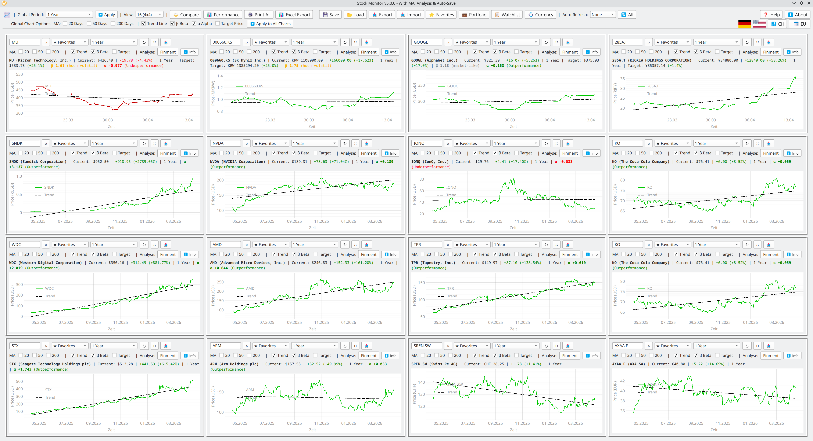
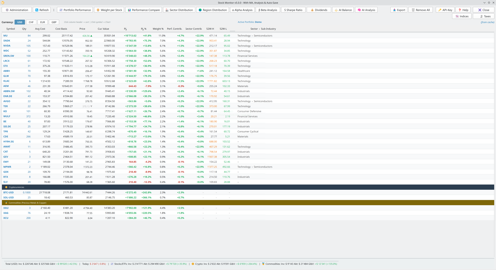
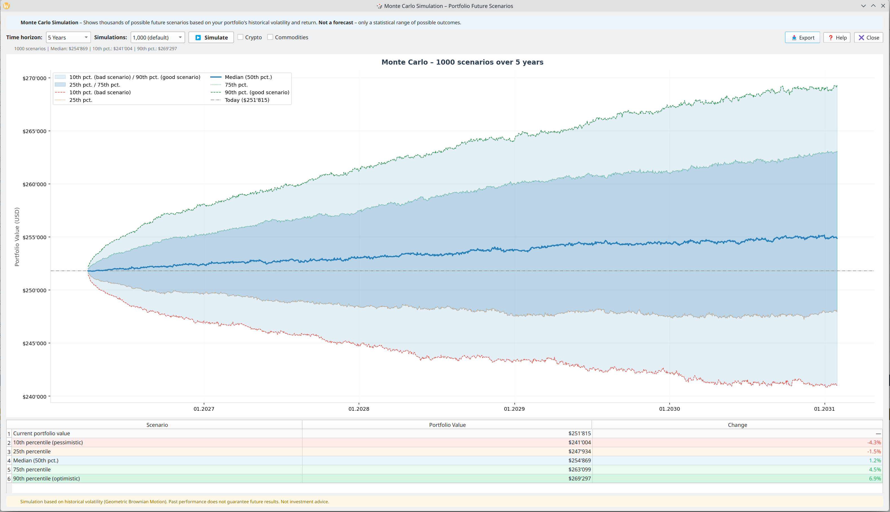
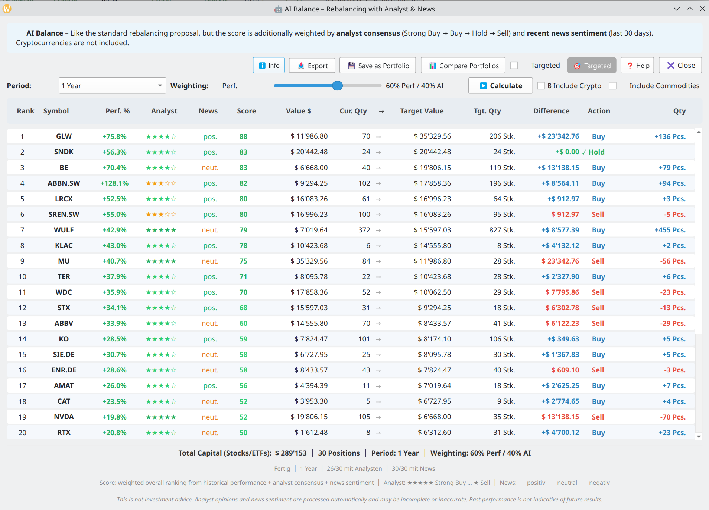
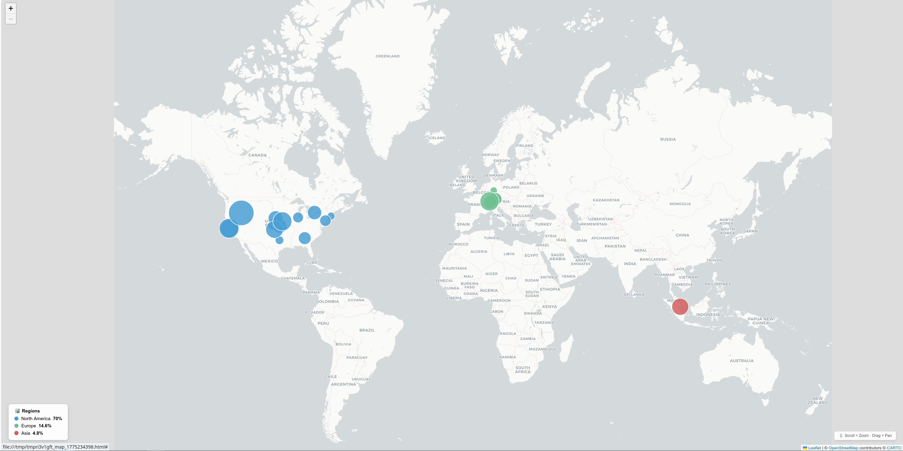
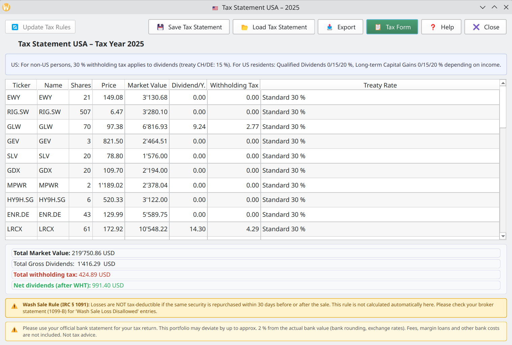

# 📈 Stock Monitor

**Professional stock portfolio management for Windows and Linux**

Stock Monitor is a free, open-source desktop application for tracking and analysing your investment portfolio. Monitor stocks, ETFs, cryptocurrencies and commodities across all major global exchanges — all in one place, without any cloud or subscription.



---

## ✨ Features

### 📊 Charts & Technical Analysis
- Up to **16 simultaneous live charts** (4 / 6 / 8 / 12 / 16)
- Time periods: 1D · 1W · 1M · 3M · 6M · 1Y · 5Y · Max
- Moving averages: MA 20 / 50 / 200
- RSI indicator, Bollinger Bands, Trendline, Candlestick, Drawdown
- Crosshair with detailed tooltip
- Double-click any chart for fullscreen zoom mode
- Auto-Refresh: 30 sec / 1 min / 5 min

### 💼 Portfolio Management
- Stocks, ETFs, cryptocurrencies and commodities in one portfolio
- Multi-currency support: USD · CHF · EUR · GBP
- Import from **Swissquote** and **Generic CSV**
- AES-256-GCM encrypted portfolio files (`.smpf`)
- Auto-save on close, auto-restore on next launch



### 🔍 Portfolio Analysis
- **Performance comparison** – all positions as bar chart
- **Sector distribution** – GICS sector breakdown
- **Region distribution** – geographic allocation on world map
- **Sharpe Ratio, Alpha, Beta** analysis
- **Monte Carlo Simulation** – thousands of future scenarios



### 🤖 AI Features
- **AI Balance** – rebalancing proposals weighted by analyst consensus and news sentiment
- **AI Analysis** – Google Gemini AI-powered portfolio analysis (API key required)



### 🌍 World Map
- Interactive map showing geographic distribution of all holdings
- Position size proportional to portfolio weight



### 🧾 Tax Module
- Tax reports for **CH · DE · AT · UK · US**
- Dividend withholding tax calculation
- Export as PDF, XLSX or ODS



### 📤 Export
- **PDF** – charts and portfolio data
- **Excel (XLSX)** – with colour-coded values and 3D bar chart
- **ODS** – LibreOffice compatible
- **Watchlist** – compare up to 50 symbols in a single chart

---

## 💻 Download & Installation

### Windows (Portable)
1. Download `StockMonitor-5.0.1-Windows.zip`
2. Extract to any folder
3. Run `stock_monitor.exe` — no installation required

[⬇ Download for Windows](https://github.com/StockMonitorCH/stock-monitor/releases/download/v5.0.1/stock_monitor.zip)

### Linux (Flatpak)

**Option 1 – One-click install (recommended)**

Click the link below — your software centre (GNOME Software, KDE Discover) opens automatically and installs Stock Monitor including automatic future updates:

[⬇ Install via Flatpak](https://StockMonitorCH.github.io/stock-monitor/StockMonitor.flatpakref)

Or from the terminal:
```bash
flatpak remote-add --user stockmonitor https://StockMonitorCH.github.io/stock-monitor/repo
flatpak install stockmonitor ch.stockmonitor.StockMonitor
```

**Option 2 – Direct download**

[⬇ Download Flatpak](https://github.com/StockMonitorCH/stock-monitor/releases/download/v5.0.1/StockMonitor-5.0.1.flatpak)

```bash
flatpak install StockMonitor-5.0.1.flatpak
```

### Run from source
```bash
pip install PyQt6 yfinance pandas matplotlib pyqtgraph cryptography
python stock_monitor.py
```

---

## 🚀 Getting Started

Stock Monitor launches with a **pre-loaded Demo portfolio** — no password required. Explore all features immediately, then create your own portfolio via ⚙ Administration.

**Quick start:**
1. Enter a symbol (e.g. `AAPL`, `NESN.SW`, `BTC-USD`) in any chart → Enter
2. Select a time period (1M / 6M / 1Y / 5Y)
3. Double-click a chart for fullscreen with RSI, Bollinger Bands, Candlestick
4. Create a portfolio: ⚙ Administration → Add positions → 💾 Save

---

## 🔒 Privacy

- **No cloud, no server, no account** — all data stays on your computer
- Portfolio files are encrypted with **AES-256-GCM**
- Market data is fetched directly from Yahoo Finance

---

## 🌐 Links

- **Website:** [stock-monitor.ch](https://www.stock-monitor.ch)
- **Support:** [info@stock-monitor.ch](mailto:info@stock-monitor.ch)

---

## ❤️ Support the Project

Stock Monitor is free and developed in spare time. If you enjoy it, any donation is appreciated:

**PayPal:** [paypal.me/StockMonitor](https://paypal.me/StockMonitor)

---

## 📄 License

GPL-3.0 — see [LICENSE](LICENSE) for details.
